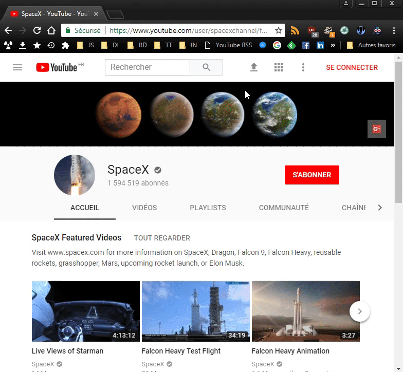

# YouTube RSS

## About
Regex-powered [bookmarklet](https://en.wikipedia.org/wiki/Bookmarklet) to quickly get a YouTube channel or playlist RSS feed URL.  
Privacy-proof way subscribe to a YouTube channel, user or playlist without creating a Google account.

## License
YouTube RSS is released under the [GNU General Public License v3.0](https://www.gnu.org/licenses/gpl-3.0.fr.html).
